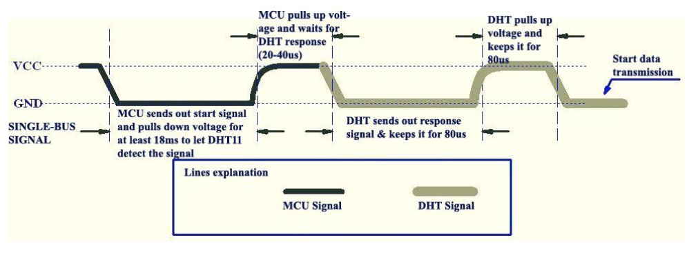
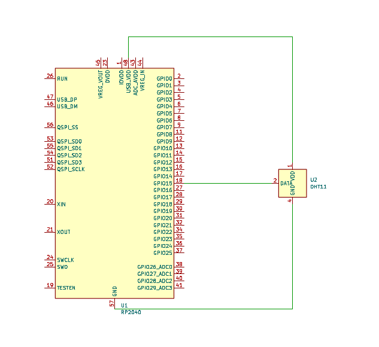

# DHT11_Fixed_Code
A correction to use the DHT11 Sensor code on Raspberry Pi PIco

## Instructions
On the [Raspberry Pi Pico examples](https://github.com/raspberrypi/pico-examples) go to the gpio folder, there's a code for using the DHT11 Sensor (Humidity & Temperature) but it seems that it doesn't work at all, so based on this graph located on the DTH11 Datasheet:

I fixed the code so that the Data arrives complete without corruption.

1. Do the Circuit connection
   
2. Paste the dht11 directory on your pico-examples folder
3. `make`
4. Open a serial terminal so you can see the readings.
